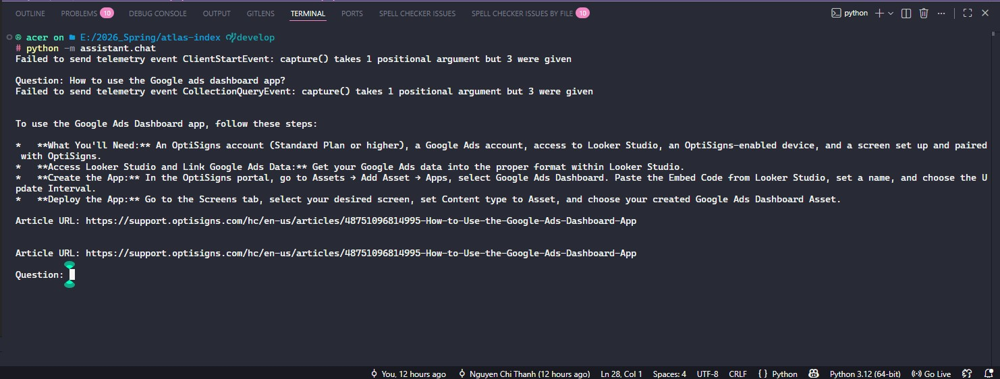

# Atlas Index

Atlas Index collects OptiSigns Help Center articles, converts them into clean Markdown files, and prepares them for semantic search with a small RAG assistant.

## Project Structure

```text
.
├── app/                  # reserved for future application modules or shared code
├── assistant/            # Gemini-powered question answering on top of indexed docs
│   └── chat.py           # interactive chat loop that queries the local article index
├── crawler/              # article collection and markdown export logic
│   └── crawl_articles.py # fetches help-center articles, cleans HTML, and writes .md files
├── docs/                 # generated markdown articles used by the RAG pipeline
├── rag/                  # chunking, embedding, and semantic search helpers
│   ├── chunk.py          # loads markdown docs and splits them into searchable chunks
│   ├── ingest.py         # embeds chunks and stores them in ChromaDB
│   ├── list_models.py    # prints available Gemini models
│   ├── search.py         # embeds a query and retrieves matching chunks
│   └── test_embedding.py # simple embedding smoke test for Gemini API access
├── vector_db/            # persistent ChromaDB storage for embeddings
├── logs/                 # runtime logs, if you choose to capture them
├── .env.sample           # example environment variables for local setup
├── .gitignore            # ignores generated files, local env files, caches, and logs
├── Dockerfile            # container image definition for the project
├── requirements.txt      # Python dependencies needed for crawling and RAG
├── README.md             # project overview, file meanings, and usage instructions
└── main.py               # entry point that starts the crawl process
```
## Flow

                OptiSigns Help Center API
                         │
                         ▼
                    Crawl Articles
                         │
                         ▼
              (Detect New / Updated Articles)
                         │
                         ▼
              Convert HTML → Markdown (.md)
                         │
                         ▼
                  Split into Chunks
                         │
                         ▼
             Generate Gemini Embeddings
                         │
                         ▼
               Store in ChromaDB (vector_db)
                         │
                         ▼
                   User Question
                         │
                         ▼
                  Semantic Search
                         │
                         ▼
              Retrieve Relevant Chunks
                         │
                         ▼
              Gemini Generates Answer
                         │
                         ▼
                  Response + Article URLs

## Chunking Strategy

The crawler converts each OptiSigns Help Center article into a Markdown file. During indexing, each document is split into fixed-size text chunks before generating embeddings.

- **Chunk size:** 800 characters
- **Chunk overlap:** 150 characters

This approach was chosen to balance retrieval quality and efficiency:

- Each chunk is large enough to preserve the context of a section or several related steps.
- A 150-character overlap helps maintain continuity between adjacent chunks and reduces the chance of losing important information at chunk boundaries.
- Smaller chunks generally improve retrieval precision, while the overlap ensures that content spanning two chunks can still be retrieved correctly.

This strategy is simple, lightweight, and works well for the structured documentation used in the OptiSigns Help Center.

## Flow Test Case

### Test Case: Crawl Article To Search Result Flow

**Goal:** verify the full local pipeline from crawling articles to searching the indexed content.

**Preconditions:**

* `.env` exists and contains valid values for `OPTISIGNS_BASE_URL`, `API_URL`, `OUTPUT_DIR`, `MAX_ARTICLES`, and `GEMINI_API_KEY`
* `docs/` is writable
* `vector_db/` is writable

**Steps:**

1. Run the crawler with `python main.py`.
2. Confirm that one or more Markdown files are created in `docs/`.
3. Open a generated Markdown file and verify it contains a title, optional `Article URL:`, a separator line, and article content.
4. Run `python -m rag.ingest` to chunk the docs and create embeddings.
5. Run `python -m rag.search` and search for a question related to one of the crawled articles.
6. Optionally run `python -m assistant.chat` and ask a question from the same article set.

**Expected result:**

* The crawler saves Markdown articles into `docs/`
* `rag.ingest` stores vectors in the local ChromaDB collection `optisigns_articles`
* `rag.search` returns relevant article chunks and their source URLs
* `assistant.chat` answers using only the retrieved context and prints up to three `Article URL:` lines

**Suggested sample question:**

```text
How do I add a YouTube video in OptiSigns?
```

## Setup

Install dependencies:

```bash
pip install -r requirements.txt
```

## Run the crawler

```bash
python main.py
```

This generates markdown articles in `docs/`.

## Build embeddings and search

After the docs are generated, run the ingestion script to populate ChromaDB:

```bash
python -m rag.ingest
```

Then you can search the indexed content or start the assistant:

```bash
python -m rag.search
python -m assistant.chat
```
## Run with Docker

Build:

```bash
docker build -t atlas-index .
```

Run:

```bash
docker run --rm --env-file .env atlas-index
```

## Scheduled Job

The project is deployed on Railway.

Schedule:

```text
0 0 * * *
```

The scheduled job:

- Crawls the OptiSigns Help Center
- Detects new or updated articles using content hashes
- Converts changed articles to Markdown
- Uploads only changed documents to the vector database
- Logs the numbers of added, updated and skipped articles

Latest execution log: logs\logs.1783131605478.json

## Assistant Demo

Example question:

```text
How to use the Google ads dashboard app?
```

Screenshot:


